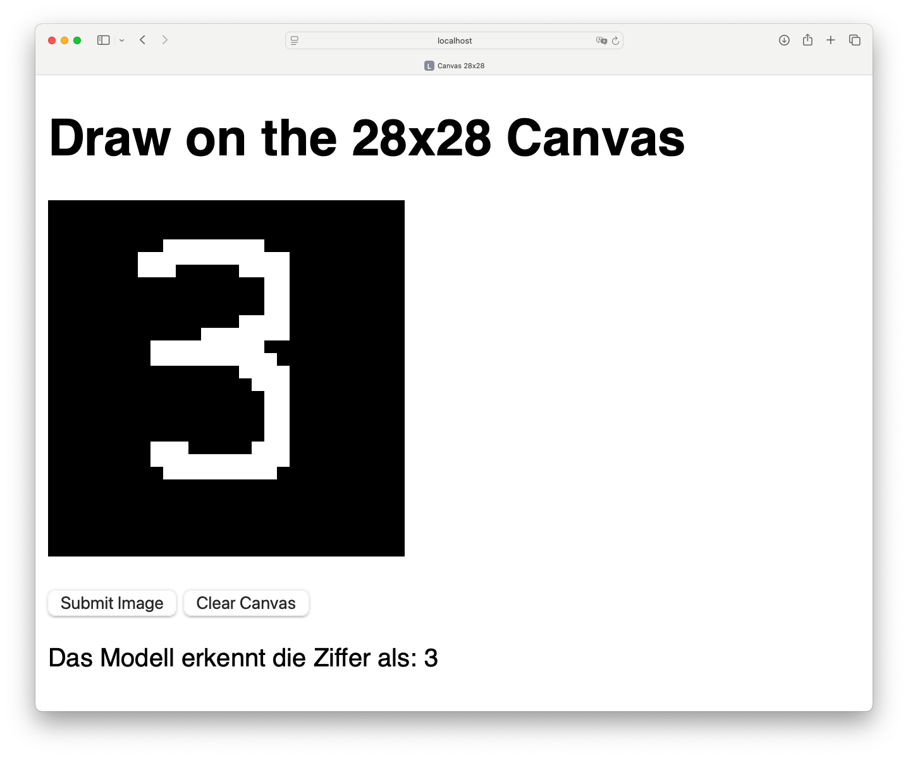

# mlp_demo

This demo and learning project demonstrates the fundamental steps of building, training, and using a simple Multi-Layer Perceptron (MLP) for digit recognition on the MNIST dataset in Go. Starting from basic implementations, it covers:

- Initializing an MLP model with configurable architecture (input, hidden, and output layers).
- Training the model on the MNIST dataset using gradient descent, backpropagation, and a suitable loss function (cross-entropy).
- Incorporating standard techniques such as ReLU activations in hidden layers and Softmax outputs to handle multi-class classification tasks.
- Implementing helper functions to load and preprocess MNIST data from IDX format, including image normalization and one-hot encoding of labels.
- Saving and loading trained model parameters (weights and biases) to/from a file for future inference.
- Demonstrating a simple inference client that loads a trained model and applies it to external input images (e.g., PNG format) to recognize handwritten digits.

This hands-on project provides a foundation for understanding basic neural networks, data handling, and model persistence in Go.

## screenshot of demo web page



## training output

```
% sw_vers                           
ProductName:		macOS
ProductVersion:		15.1.1
BuildVersion:		24B91


% sysctl -n machdep.cpu.brand_string
Apple M2 Pro


% date; ./train; date             
Sun Dec  8 14:41:44 CET 2024
Lade MNIST Trainingsdaten...
Lade MNIST Testdaten...
MLP mit 784 Eingabeneuronen, 512 versteckten Neuronen und 10 Ausgabeneuronen
Lernrate: 0.0900, 50 Epochen, Batch-Größe: 50
Epoche 0, Loss: 0.4673, TrainAcc(10k): 92.91%, TestAcc: 92.93%
Epoche 1, Loss: 0.2138, TrainAcc(10k): 95.37%, TestAcc: 95.09%
Epoche 2, Loss: 0.1541, TrainAcc(10k): 96.60%, TestAcc: 96.09%
Epoche 3, Loss: 0.1203, TrainAcc(10k): 97.19%, TestAcc: 96.57%
Epoche 4, Loss: 0.0990, TrainAcc(10k): 97.73%, TestAcc: 97.04%
Epoche 5, Loss: 0.0834, TrainAcc(10k): 98.09%, TestAcc: 97.41%
Epoche 6, Loss: 0.0713, TrainAcc(10k): 98.17%, TestAcc: 97.37%
Epoche 7, Loss: 0.0624, TrainAcc(10k): 98.55%, TestAcc: 97.63%
Epoche 8, Loss: 0.0553, TrainAcc(10k): 98.77%, TestAcc: 97.67%
Epoche 9, Loss: 0.0483, TrainAcc(10k): 98.97%, TestAcc: 97.91%
Epoche 10, Loss: 0.0436, TrainAcc(10k): 99.04%, TestAcc: 97.89%
Epoche 11, Loss: 0.0389, TrainAcc(10k): 99.19%, TestAcc: 97.88%
Epoche 12, Loss: 0.0349, TrainAcc(10k): 99.28%, TestAcc: 97.87%
Epoche 13, Loss: 0.0315, TrainAcc(10k): 99.44%, TestAcc: 98.04%
Epoche 14, Loss: 0.0285, TrainAcc(10k): 99.36%, TestAcc: 98.07%
Epoche 15, Loss: 0.0260, TrainAcc(10k): 99.52%, TestAcc: 98.13%
Epoche 16, Loss: 0.0233, TrainAcc(10k): 99.62%, TestAcc: 98.04%
Epoche 17, Loss: 0.0213, TrainAcc(10k): 99.66%, TestAcc: 98.10%
Epoche 18, Loss: 0.0192, TrainAcc(10k): 99.72%, TestAcc: 98.15%
Epoche 19, Loss: 0.0176, TrainAcc(10k): 99.78%, TestAcc: 98.06%
Epoche 20, Loss: 0.0160, TrainAcc(10k): 99.78%, TestAcc: 98.11%
Epoche 21, Loss: 0.0147, TrainAcc(10k): 99.81%, TestAcc: 98.06%
Epoche 22, Loss: 0.0136, TrainAcc(10k): 99.89%, TestAcc: 98.16%
Epoche 23, Loss: 0.0124, TrainAcc(10k): 99.87%, TestAcc: 98.20%
Epoche 24, Loss: 0.0116, TrainAcc(10k): 99.91%, TestAcc: 98.11%
Epoche 25, Loss: 0.0105, TrainAcc(10k): 99.91%, TestAcc: 98.08%
Epoche 26, Loss: 0.0098, TrainAcc(10k): 99.93%, TestAcc: 98.16%
Epoche 27, Loss: 0.0091, TrainAcc(10k): 99.94%, TestAcc: 98.11%
Epoche 28, Loss: 0.0085, TrainAcc(10k): 99.95%, TestAcc: 98.13%
Epoche 29, Loss: 0.0079, TrainAcc(10k): 99.96%, TestAcc: 98.25%
Epoche 30, Loss: 0.0074, TrainAcc(10k): 99.97%, TestAcc: 98.21%
Epoche 31, Loss: 0.0069, TrainAcc(10k): 99.98%, TestAcc: 98.21%
Epoche 32, Loss: 0.0064, TrainAcc(10k): 99.99%, TestAcc: 98.18%
Epoche 33, Loss: 0.0061, TrainAcc(10k): 99.98%, TestAcc: 98.23%
Epoche 34, Loss: 0.0056, TrainAcc(10k): 99.98%, TestAcc: 98.24%
Epoche 35, Loss: 0.0054, TrainAcc(10k): 99.93%, TestAcc: 98.20%
Epoche 36, Loss: 0.0051, TrainAcc(10k): 99.98%, TestAcc: 98.31%
Epoche 37, Loss: 0.0048, TrainAcc(10k): 99.98%, TestAcc: 98.15%
Epoche 38, Loss: 0.0046, TrainAcc(10k): 100.00%, TestAcc: 98.19%
Epoche 39, Loss: 0.0043, TrainAcc(10k): 99.99%, TestAcc: 98.28%
Epoche 40, Loss: 0.0042, TrainAcc(10k): 99.99%, TestAcc: 98.21%
Epoche 41, Loss: 0.0040, TrainAcc(10k): 100.00%, TestAcc: 98.29%
Epoche 42, Loss: 0.0038, TrainAcc(10k): 100.00%, TestAcc: 98.23%
Epoche 43, Loss: 0.0036, TrainAcc(10k): 100.00%, TestAcc: 98.19%
Epoche 44, Loss: 0.0035, TrainAcc(10k): 100.00%, TestAcc: 98.25%
Epoche 45, Loss: 0.0033, TrainAcc(10k): 100.00%, TestAcc: 98.26%
Epoche 46, Loss: 0.0032, TrainAcc(10k): 100.00%, TestAcc: 98.24%
Epoche 47, Loss: 0.0031, TrainAcc(10k): 100.00%, TestAcc: 98.23%
Epoche 48, Loss: 0.0029, TrainAcc(10k): 100.00%, TestAcc: 98.24%
Epoche 49, Loss: 0.0028, TrainAcc(10k): 100.00%, TestAcc: 98.27%
Sun Dec  8 16:22:55 CET 2024

```
